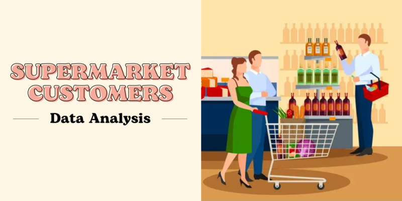

## About

A Supermarket selling various items, ranging from common household supplies (meats, fish, and fruits) to specific commodities (wines, sweets, and golds) towards various kinds of individual customers. Clients of this Supermarket may purchase the products directly in stores or via other media, namely website and catalog. This Supermarket also has done six promotional campaigns to their customers offering discounted price.

Apparently the conversion rate (percentage of customers accepting those discount offerings) are persistently low from one campaign to another. This questions the effectivity of Supermarket's campaign process. Supermarket's Marketing Manager as our stakeholder then tasked us, the data analyst, to find a new approach that can solve this "low-rate" problem.

## Usage

Users can clone this project by running the following code:

    git clone git@github.com:garudapaksi-yusuf/Supermarket_Customers.git

Users can also view the Jupyter Notebook directly in notebook/Supermarket Customers.ipynb

Tableau dashboard of this project provided <a href="https://public.tableau.com/app/profile/garudapaksi.yusuf/viz/Book5_17138623654830/Summary">here</a>.

## Project Organization

The directory structure of Supermarket_Customers project is shown below:

    ├── README.md          <- Top-level README for developers using this project.
    │
    ├── data               <- Supermarket Customers Database & Data Dictionary.
    │
    ├── docs               <- Images and other documentation for this project.
    │
    ├── notebook           <- Jupyter Notebook of this project.
    │
    └── requirements.txt   <- Module requirements for reproducing the project environment;
                              manually generated with session_info